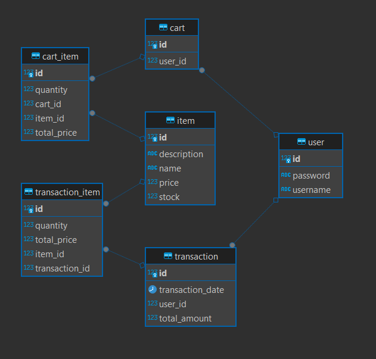

# knowledge base
1. Apa yang anda ketahui tentang Rest API?
2. Apa yang anda ketahui tentang Server side and Client side processing?
3. Apa yang anda ketahui tentang Monolith dan Microservices, berikan contohnya?
4. Apa yang anda ketahui tentang Design pattern inversion of Control serta Dependency Injection?
5. Apa yang anda ketahui tentang Java programming dan Spring framework khususnya spring-boot?

## Jawab:
1. RestAPI adalah suatu cara untuk melakukan komunikasi antar aplikasi melalui jaringan dengan menggunakan HTTP request. dengan maksud atau tujuan untuk memudahkan integrasi dari berbagai aplikasi ataupun layanan.

2. - Server Side Processing: Pengolahan atau proses yang dilakukan di server, seperti business logic, otentifikasi user, dan interaksi dengan database.
   - Clinet Side Processing: Pengolahan atau proses yang dilakukan di client (browser), seperti Validasi pada sebuah form, dengan tujuan kenyamanan user agar lebih responsif.

3. - Monolith: adalah salah satu proses pendekatan untuk membangun sebuah aplikasi, dimana seluruh aplikasi dibangun sebagai satu kesatuan unit (tunggal). contohnya aplikasi e-commerce tradisional, dimana semua komponen seperti produk, cart, dan checkout itu terintegrasi didalam satu project/aplikasi.
   - Microservices: adalah salah satu proses pendekatan untuk membangun sebuah aplikasi, dimana aplikasi dibangun atas layanan-layanan (service) yang kecil, independen, dan terpisah yang berkomunikasi melalui API. contohnya aplikasi e-commerce modern, yang memiliki layanan terpisah antara produk, cart, dll. setiap layanan dikelola secara mandiri dan independen.

4. - Design Pattern Inversion of Control (IoC): adalah design pattern yang mengembalikan kendali alur aplikasi dari kode ke framework.
   - Dependency Injection: adalah salah satu teknik untuk menerapkan IoC dengan menyediakan dependensi kedalam objek dari luar (bukan dibuat didalam objek itusendiri).

5. - Java Programming: adalah bahasa pemrogramman yang berorientasi Objek (OOP).
   - Spring Framework: adalah framework untuk mempermudah dalam membuat atau membangun sebuah aplikasi java.
   - Spring-boot: adalah subproject dari spring framework yang berfungsi sebagai penyederhana aplikasi spring dengnakonfigurasi otomatis, starter POMs dan tambahanm layanan lainya.

#  Jawaban Desain Database 
dalam project ini saya membuat aplikasi secara monolith (karena aplikasi yang dibuat ingin selesai secara cepat dan belum memerlukan proses yang kompleks)

pada database, saya memiliki tabel-tabel berikut:
1. Tabel user
2. Tabel item
3. Tabel cart
4. Tabel cart_item
5. Tabel transaction
6. Tabel transaction_item

dan untuk ER Diagram seperti berikut:

dan penjelsan modul-modul yang saya buat, secara garis besar  seperti berikut:
1. User berfungsi untuk melakukan cek apakah username dan password ada atau tidak, jika ada maka akan bisa mengakses semua endpoint, jika tidak ada maka tidak bisa. (hanya menggunakan Basic Auth)
2. Item berfungsi untuk mengelola data items seperti menampilkan semua item (untuk keperluan catalog) dan mnempilkan item by id (untuk keperluan item detail)
3. Cart berfungsi untuk mengelola cart, seperti menambahkan item ke dalam cart, menampilkan item yang ada pada cart dan melakukan checkout.
4. Transaction berfuungsi untuk mengelola transaction, seperti menampilkan semua transaksi (untuk keperluan transaction list) dan menampilkan transaksi by id (untuk keperluan transaction detial0

